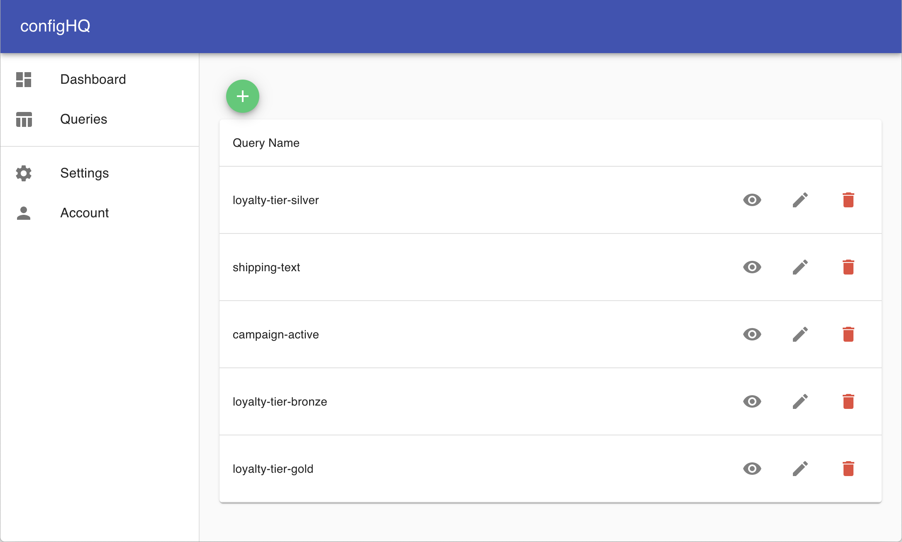
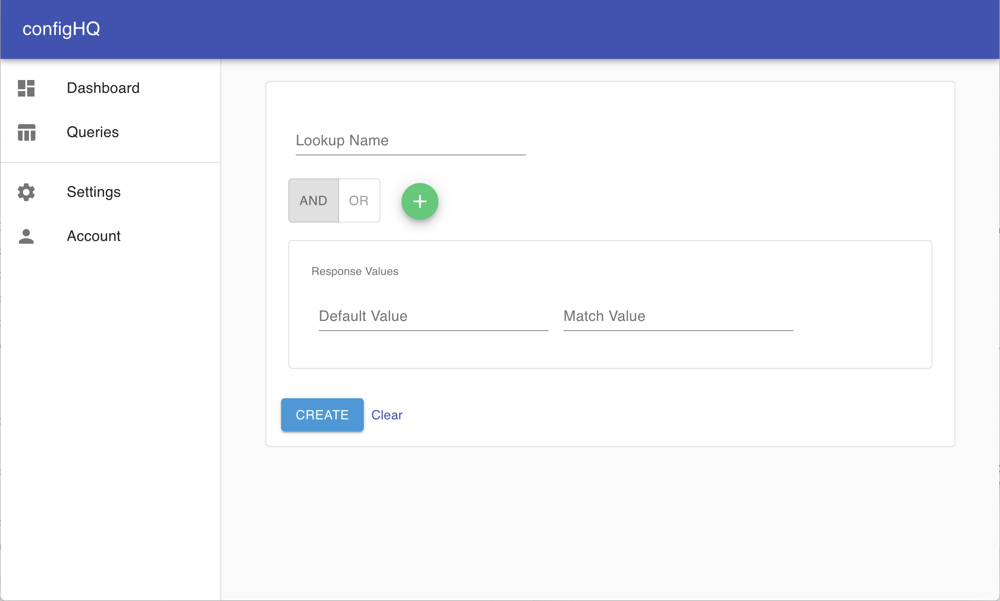
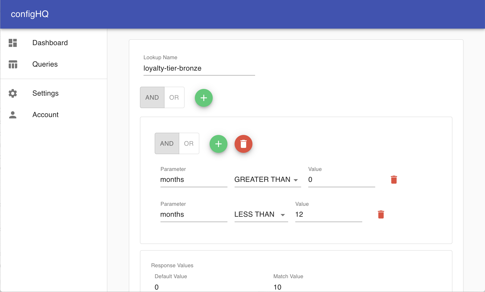

# configHQ

**configHQ** is a centralized configuration platform, which can be used as a flexible way to configure applications at runtime. Some suggested use cases: Product configurations/settings with exception handling, one/region based configurations, feature flagging, whitelisting of internal/external services, high performance key-value store, implementation of peer review process for adding, updating or removing configurations.

**configHQ** fits perfectly in a microservice architecture, and can be run as a microservice itself.

## How to use
**configHQ** can be managed through a user-friendly, web-based admin interface. The core of the user interface is a query builder, which is used for easy setup of configuration query rules or value storage.

### Step 1: Go to Queries
The queries page will show existing queries. To create a new query, click the green button with a plus-sign above the table.

### Step 2: Create the query
The query builder can be used to define a very fine grained query, with multiple groups of rules. For a successful query, either one (OR) or all (AND) groups must fulfill group rules.

|  |  |
| --------------------------------------------- | ------------------------------------------------- |
| Query Builder                                 | Example                                           |

Each group can have either one or more rules. A rule is a logical operation. In the example above, the rule checks if a user belongs to the bronze level of a loyalty program. The rule specifies the user's membership must be greater than 0 months and less than 12 months to be categorized as a bronze member.

Lets say the loyalty level qualifies for a specific discount, the response of the query will return a 0% discount if as default, and a 10% discount if the user's memebership lenght is up to 12 months.  

## Disclosure   
**configHQ** is a project submitted to the RedisConf2021 Hackathon, and is not intended to be used in production at this point. The purpose of the code is to show an example of how Redis services can be used, and the code has not gone through testing, optimization or security audits. The project is available as-is without any warranties or guarantees, and usage is at own risk.
