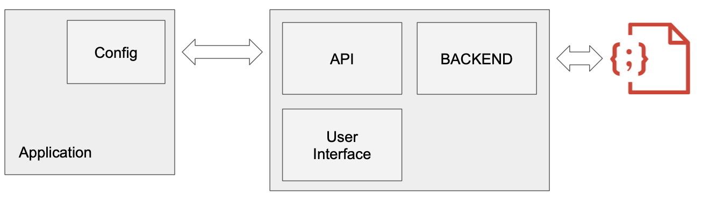
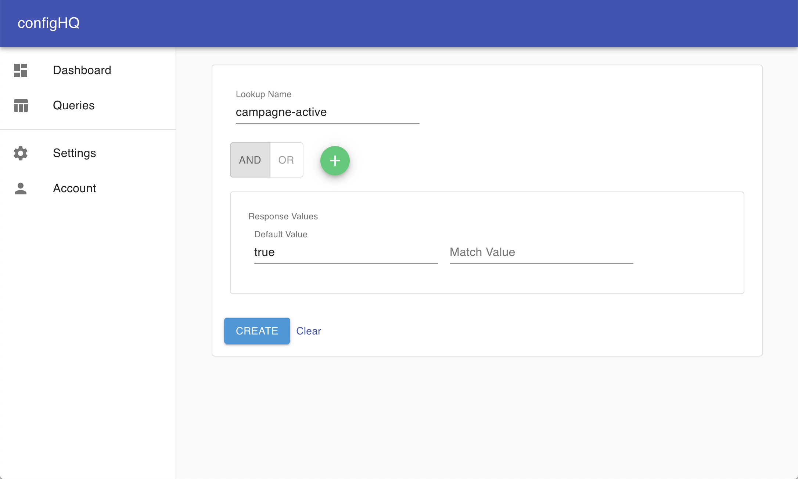
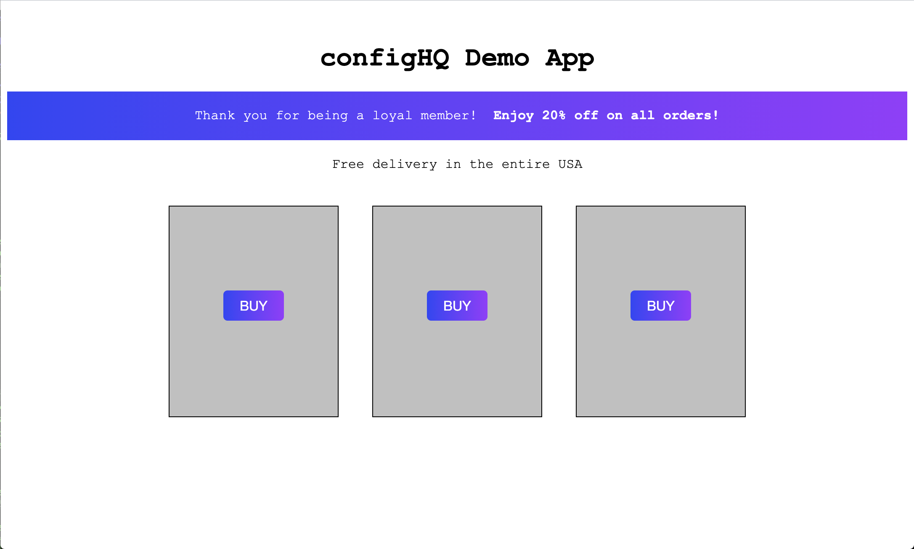
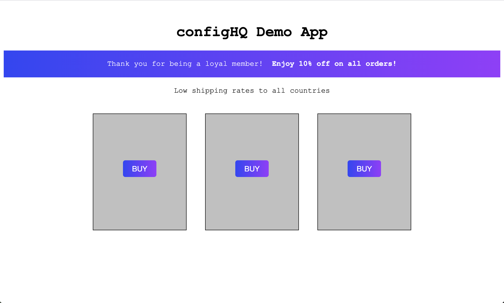
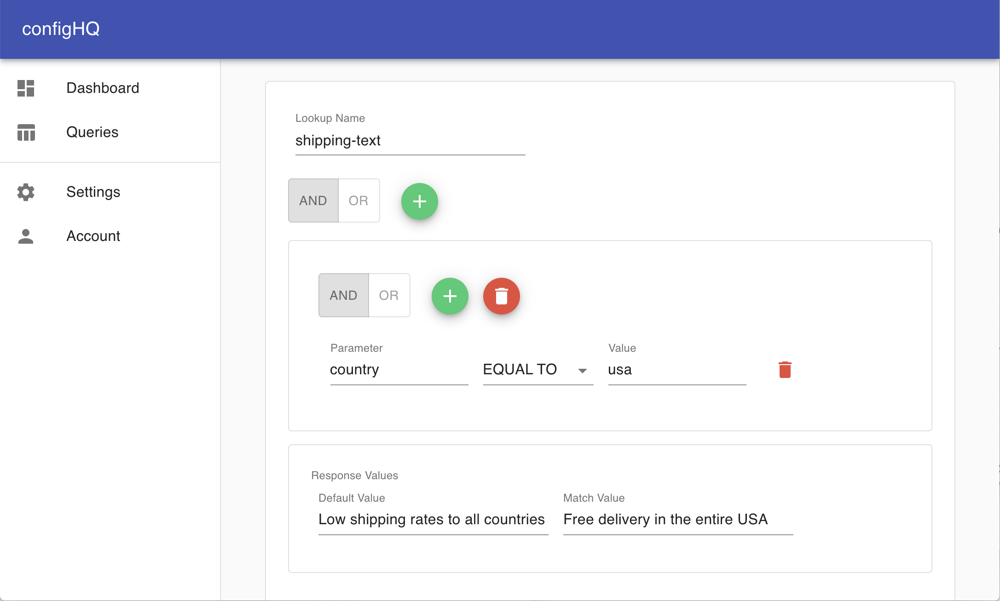
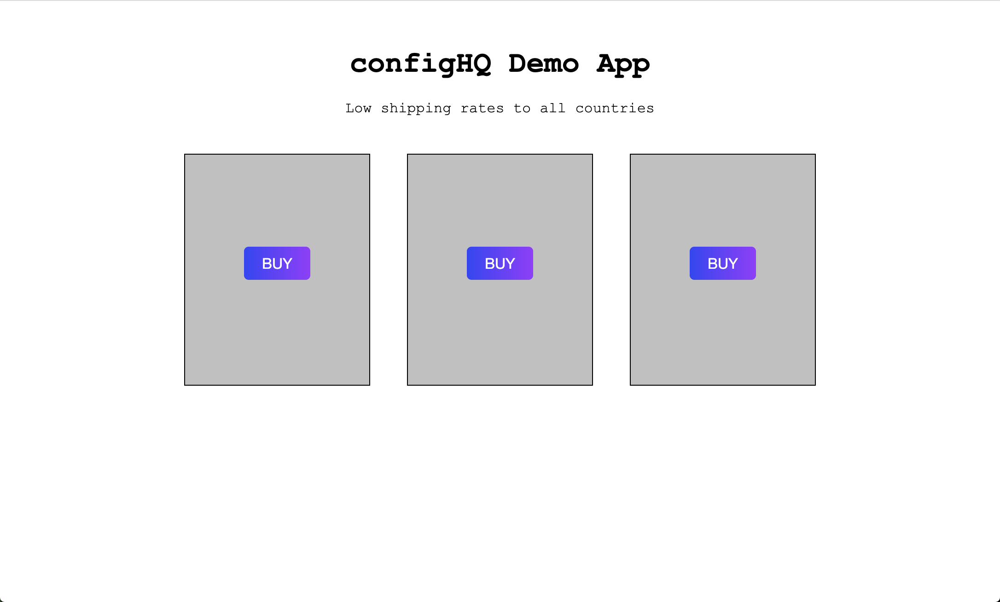

# configHQ

**configHQ** is a centralized configuration platform, which can be used as a flexible way to configure applications at runtime. Some suggested use cases: Product configurations/settings with exception handling, one/region based configurations, feature flagging, whitelisting of internal/external services, high performance key-value store, implementation of peer review process for adding, updating or removing configurations.

**configHQ** fits perfectly in a microservice architecture, and can be run as a microservice itself.

## Architecture
**configHQ** is a service which provides an API for applications to pull configurations. RedisJSON is used for storing the configuration queries in JSON format.

Configurations are key to the application functionality and behavior, so the speed of pulling the configuration is critical. For this purpose RedisJSON works really well, since the configurations are stored as JSON in memory. 

## How to use
**configHQ** can be managed through a user-friendly, web-based admin interface. The core of the user interface is a query builder, which is used for easy setup of configuration query rules or value storage.

### Step 1: Go to Queries
The queries page will show existing queries. To create a new query, click the green button with a plus-sign above the table.

|  |  |
| ------------------------------------------- | ----------------------------------------------------- |
| Queries                                     | Query Builder                                         |

### Step 2: Create the query
The query builder can be used to define a very fine grained query, with multiple groups of rules. For a successful query, either one (OR) or all (AND) groups must fulfill group rules.

Each group can have either one or more rules. A rule is a logical operation. In the example above, the rule checks if a user belongs to the bronze level of a loyalty program. The rule specifies the user's membership must be greater than 0 months and less than 12 months to be categorized as a bronze member.

Lets say the loyalty level qualifies for a specific discount, the response of the query will return a 0% discount if as default, and a 10% discount if the user's memebership lenght is up to 12 months.  

### Step 3: Implement in application or service

The queries can now be used in an application or a service, to determine features, behavior, values and much more. Below is an example application which uses **configHQ** to manage the following:

- Show a discount banner if a campaign is active
- Show free delivery if the user is located in the US, otherwise generic text
- Set discount percentage based on the length of the user's membership

|  |  |
| ------------------------------------------- | ----------------------------------------------------- |
| In this example, the query is used as a key-value store, without rules, and the default response value holds the value of the key *campaign-active*. | The campaign banner is enabled because *campaign-active* returns the value true. |

|  |  |
| ------------------------------------------- | ----------------------------------------------------- |
| In this example, the loyaly tier bronze is defined as a membership length in months between 0 and 12 months. The response value is 10(%) if the range is met, otherwise 0. | The response value returns a discount percentage based on the length of a user's membership. |

|  |  |
| ------------------------------------------- | ----------------------------------------------------- |
| In this example, the user is an international member, located outside the USA. The *shipping-text* query is used to return one text if the user is in the US, and another for international users. | Since the user is located outside the US, a generic text about shipping is shown. |

## Disclosure   
**configHQ** is a project submitted to the RedisConf2021 Hackathon, and is not intended to be used in production at this point. The purpose of the code is to show an example of how Redis services can be used, and the code has not gone through testing, optimization or security audits. The project is available as-is without any warranties or guarantees, and usage is at own risk.
